# Buổi 1
### Request - response
Request: HTTP method
* Get: Lấy dữ liệu (Read)
* Post: Đẩy dữ liệu mới hoàn toàn
* Put: Chỉnh sửa dữ liệu nhưng cập nhật theo cụm, cụm mình muốn thay đổi sẽ biết hoàn toàn thành cụm mới mình vừa đẩy (những thông tin mình có ghi thì nó sẽ cập nhật lên cụm còn những thông tin mình không ghi mà có trong cụm ban đầu thì sẽ biến mất).
```
cập nhật cụm sách- cụm ban đầu
{
tên sách:hahihihi
tên tác giả: Ha 
}
```
```
đẩy put lên
{
    tên sách: hatruongtrong 
}
```
```
cụm biến thành
{
    tên sách: hatruongtrong
}
=> đã mất đi thông tin tên tác giả và tên sách cũng được cập nhật
```
* Patch: CHỉnh sửa dữ liệu theo cách cập nhập những dữ liệu mới mình đẩy lên, những dữ liệu mình không nhắc tới sẽ dữ nguyên.
* Delete: Xóa dữ liệu.

Response: Trả về dưới dạng Json và status code (mã xxx báo trạng thái thành công thất bại lỗi...)

### API Endpoint: chủ yếu làm theo chuẩn REST ( REST, REST API, RESTful)
 Là địa chỉ cụ thể của dữu liệu 

 VD https://hahihi.com/ha/truong/trong

 https://hahihi.com : đây là địa chỉ của server
  
/ha/truong/trong : đây là API endpoint


# Buổi 2
### Dependency injection
(Là cách hiện thực hóa của 1 mẫu thiết kế) 
```
            controller : Khai báo API endpoint

            service    : Xử lí dữ liệu

            ORM        : Kết nối đến nơi chứa cơ sở dữ liệu 

ở dưới là low lever theo mức độ tăng dần từ dưới lên 
```
Dependency inversion (Nguyên lí) : 
* class lever cao sẽ không nên phụ thuộc vào class lever thấp, giao tiếp thông qua tính trừu tượng.
VD: một chiếc ô tô sẽ không quan tâm khối động cơ làm từ cái gì làm như thế nào nó chỉ quan tâm khối động cơ cho được ra công xuất và ô tô chạy.
* Abstraction không phụ thuộc vào chi tiết.
VD: B là implement của A thì A sẽ k quan tâm B được tạo ra như nào nó sẽ gọi đến B qua interface 

Inversion of control: là 1 dạng của Dependency inversion. Nó có 1 container để chứa tất cả các dependency của project, implementation (class implement của 1 interface hoặc adbstrac class nào đó) 
 
Khi A muốn dùng B thì nó sẽ vào container tìm, còn việc khởi tạo B sẽ do container làm

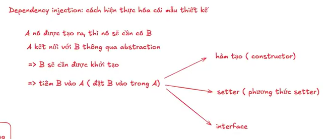
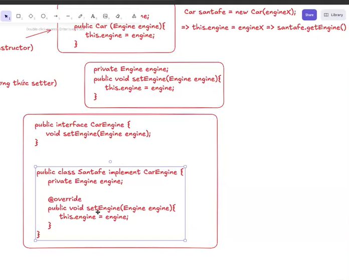
### AOP

# Buổi 3
## Project
Package cần thiết: controller, service, repositori 
### Controller 
@restcontroller (khai báo rằng viết controller theo chuẩn rest)

@RequestMapping ("đường dẫn mặc định cho class này" VD: /api/v1/products/ ): cái này sẽ lưu đường dẫn của class và những thằng trong class thêm vào sẽ dứng kế tiếp đằng sau đường dẫn mặc định  

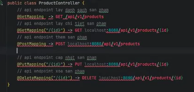

@GetMapping => lấy đường dẫn, vì phần trên @RequestMapping mình đã ghim đường dẫn của class rồi nên khi muốn lấy danh sách chương trình sẽ tự hướng mình đến API Endpoint đấy

@GetMapping({id}) => chỉ mình đến sản phẩm cụ thể qua id sản phẩm của mình {id} sẽ tự được thêm vào đường dẫn sau đường dẫn của @RequestMapping.

@PostMapping => chương trình sẽ tự hiểu là thêm sản phẩm vào danh sách của dường dẫn vì mình đặt đường dẫn mặc định ở @RequestMapping rồi.

@PutMapping({id}) => muốn thay đổi thì phải có cả id của sản phẩm chi tiết 

@DeleteMapping({id}) => xóa sản phẩm chi tiết.

Biến ở trong đường dẫn có 2 cách thể hiện:
* /{id} => đây gọi là path variable: biến ở trong dường dẫn, biến được thể hiện trong dấu ngoặc nhọn.
* request parameter: 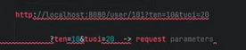 : tham số được để trong path. Dùng để mở rộng thêm ngữ cảnh cho đường path 
* Kết luận: path variable dùng để dẫn đến 1 tài nguyên cụ thể VD: quyển sách cụ thể trong giá sách, path parameter dùng để cung cấp thêm thông tin mở rộng cho yêu cầu của mình (thường là tìm kiếm hoặc sắp xếp) VD: mình tìm đến giá sách nhưng mình muốn lọc tên theo bảng chữ cái. 


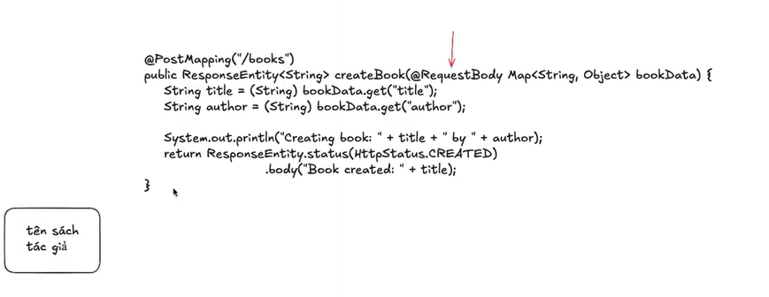
@RequestBody => Lấy dữ liệu JSON từ body của request và chuyển thành object Java VD: mình muốn post 1 quyển sách lên và mình muốn truyền dữ liệu theo kiểu Json thì dùng @RequestBody 
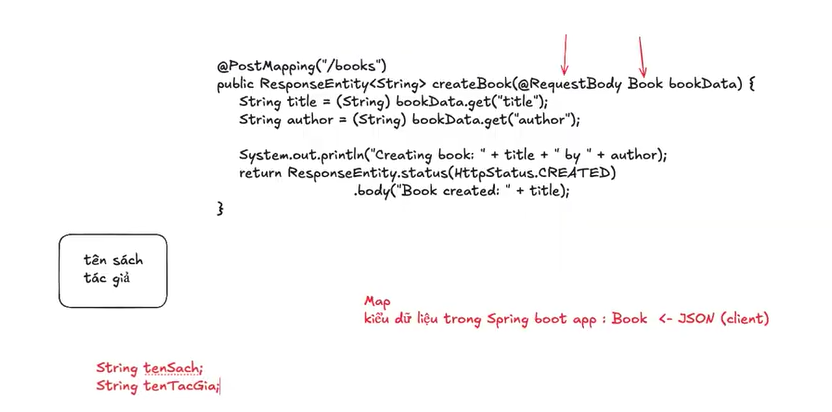

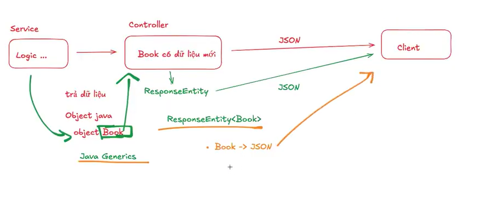  **ReponseEntity**: biến dữ liệu thô thành dạng Json. Để đảm bảo dữ liệu mà service trả về phải đúng là dữ liệu book thì phải để ResponseEntity<Book> để nó chỉ nhận duy nhất  kiểu dữ liệu Book 

 **Generic**
 cho phép bạn viết code mà không cần chỉ rõ kiểu dữ liệu cụ thể ngay từ đầu, mà sẽ chỉ định sau này khi sử dụng.


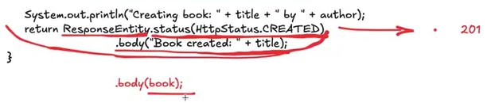 Dữ liệu trả về .body(book); trả về dạng Json.

# Buổi 4
## Object 
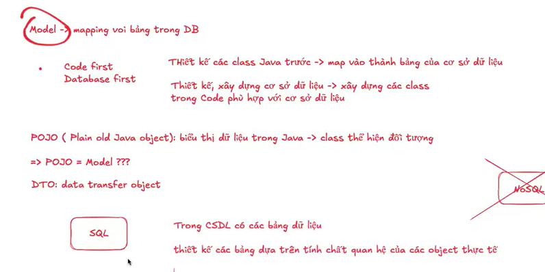
### model
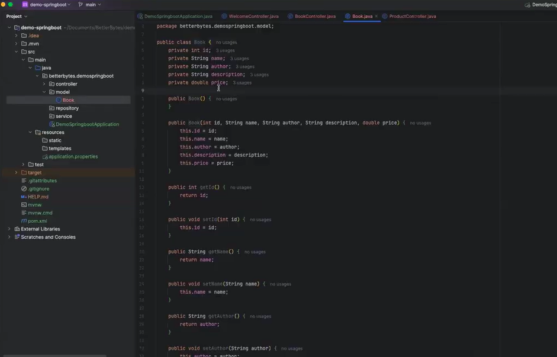
Model thường là đối tượng gắn với cơ sở dữ liệu

Model Mapping với bảng trong DB.

Có 2 hướng để tạo model:
* code first: thiết kế class java trương => mapping với các bảng CSDL
* DB first: xây dựng CSDL trước => xây dựng class phù hợp với CSDL.
### POJO (plan old java object)
* Là một class Java thuần túy, không phụ thuộc vào bất kỳ framework nào (Spring, Hibernate...).
* Chỉ chứa các thuộc tính, getter/setter, constructor và không chứa logic phức tạp.
* POJO có thể = model.
### DTO (data transfer object)
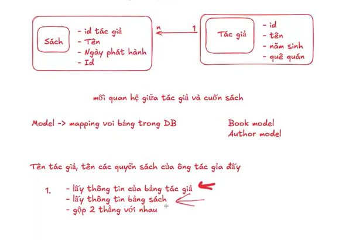
Tạo 1 trung gian để nhận gửi dữ liệu giữa controller với service
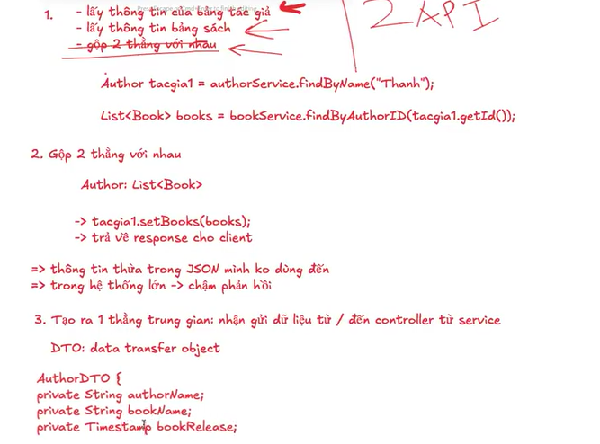 
### Bean
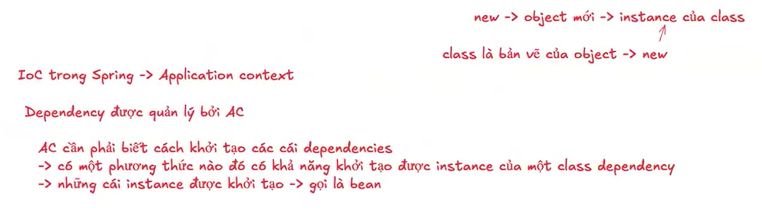

* Bean scope: số bean của dependency đưuocj tạo trong vòng đười của trương trình:

